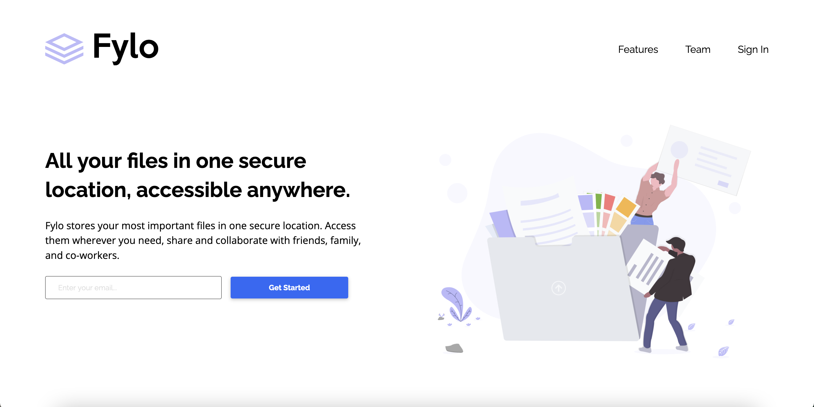

# Frontend Mentor - Fylo landing page with two column layout solution

This is a solution to the [Fylo landing page with two column layout challenge on Frontend Mentor](https://www.frontendmentor.io/challenges/fylo-landing-page-with-two-column-layout-5ca5ef041e82137ec91a50f5). Frontend Mentor challenges help you improve your coding skills by building realistic projects. 

## Table of contents

- [Overview](#overview)
  - [The challenge](#the-challenge)
  - [Screenshot](#screenshot)
  - [Links](#links)
- [My process](#my-process)
  - [Built with](#built-with)
  - [What I learned](#what-i-learned)
- [Author](#author)

## Overview

### The challenge

Users should be able to:

- View the optimal layout for the site depending on their device's screen size
- See hover states for all interactive elements on the page

### Screenshot

### Links

- Solution URL: [https://github.com/RickyReyes/fylo-landing-page](https://github.com/RickyReyes/fylo-landing-page)
- Live Site URL: [https://fylo-landing-page-umber.vercel.app/](https://fylo-landing-page-umber.vercel.app/)

## My process

First, I wrote the HTML while looking at both the mobile and desktop designs.
- I started with mobile, but planned ahead for the desktop design, especially for any Flexbox or CSS Grid that I'd be using.

Next, I layed out all the sections on the page using either Flexbox or Grid, deciding how the transition from mobile to desktop should look.

Finally, I added some JavaScript for the email validations, and hover events on CSS.

### Built with

- Semantic HTML5 markup
- Sass
- Flexbox
- CSS Grid
- Mobile-first workflow

### What I learned

- This project helped me get more comfortable using CSS Grid and Flexbox.

## Author

- Frontend Mentor - [@RickyReyes](https://www.frontendmentor.io/profile/RickyReyes)
- Twitter - [@RKYNTR](https://www.twitter.com/RKYNTR)